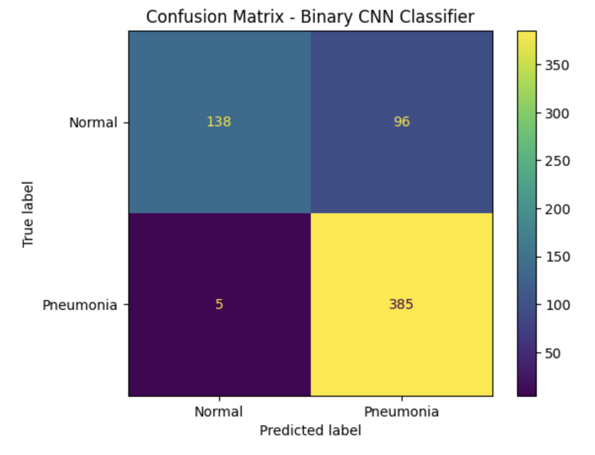

# Student Name

Junjae Lee

---
## Presentation Video

YouTube Link: [Watch the presentation video](https://youtu.be/dqqJz4TLvmY)

# Project Title

**Comparing Anomaly Detection and Supervised Classification for Pneumonia X-ray Images**

---

# 1. Introduction

Medical image analysis is one of the important applications of deep learning. In this project, I focus on pneumonia detection using chest X-ray images. The dataset used in this project is PneumoniaMNIST, which contains normal and pneumonia chest X-ray images. Although PneumoniaMNIST is originally designed as a binary classification dataset, I first reformulated it as an anomaly detection problem.

The reason for starting with anomaly detection was that medical abnormal data can be difficult to collect and label in real situations. For supervised classification, both normal and abnormal images must be labeled. However, in anomaly detection, the model can be trained only with normal images and then detect images that are different from normal patterns. This approach can reduce the need for disease-specific labels and may be useful when abnormal examples are rare or unknown. However, this setting is also more difficult because the model does not directly learn pneumonia features.

Therefore, this project compares normal-only anomaly detection methods with a supervised binary CNN classifier. The goal is to understand which approach is more suitable for pneumonia X-ray detection and why some methods worked better than others.

---

# 2. Task and Dataset

The task is to detect pneumonia from chest X-ray images. The dataset is PneumoniaMNIST from the MedMNIST collection. Each image is a small grayscale X-ray image, and the label is either normal or pneumonia.

In the anomaly detection setting, I used only normal X-ray images for training. Pneumonia images were not used during training and were treated as anomalous samples during testing. This setting is different from standard binary classification because the model does not learn pneumonia examples directly.

For the supervised classification setting, I trained a Binary CNN classifier using both normal and pneumonia images. This model is used as a supervised benchmark to compare with the anomaly detection methods.

---

# 3. Methods

## 3.1 Autoencoder Reconstruction Error

The first method is reconstruction-based anomaly detection using a convolutional autoencoder. The autoencoder is trained only on normal X-ray images. The basic assumption is that the model will reconstruct normal images well, but it will reconstruct abnormal images poorly. Therefore, a high reconstruction error is expected to indicate an anomaly.

However, this method depends strongly on the assumption that abnormal images are harder to reconstruct than normal images. If abnormal images are simpler or smoother in pixel-level structure, they may still have low reconstruction error. This became an important issue in the experiment.

## 3.2 Encoder Feature + Mahalanobis Distance

The second method is feature-based anomaly detection. Although the reconstruction error result was unexpected, I still used the autoencoder encoder to extract features. The reason is that the failure of the first method was mainly related to using pixel-level reconstruction error as the anomaly score. It did not necessarily mean that the encoder learned no useful information. The encoder may still contain compressed representations of normal X-ray images.

In this method, I extracted feature vectors from the encoder and measured how far each test image was from the normal feature distribution. I used Mahalanobis distance instead of simple Euclidean distance because Mahalanobis distance considers the variance and correlation structure of the feature dimensions. In other words, it measures distance from a distribution, not just distance between two points. This makes it more suitable for anomaly detection in feature space.

## 3.3 Binary CNN Classifier

The final model is a Binary CNN classifier. Unlike the anomaly detection methods, this model uses both normal and pneumonia images during training. Therefore, it directly learns visual features related to pneumonia. This model is not an anomaly detection model, but it is used as a supervised reference model.

The purpose of adding this model was to check whether the low performance of anomaly detection methods came from the difficulty of the dataset or from the limitation of normal-only training. If the CNN classifier performs much better, it suggests that supervised learning is more suitable when pneumonia labels are available.

---

# 4. Experiments

I implemented the experiments using Python, PyTorch, and the MedMNIST package on Google Colab. The input images from PneumoniaMNIST were 28×28 grayscale chest X-ray images. The label 0 indicates a normal image, and the label 1 indicates a pneumonia image.

I compared three main approaches:

1. Autoencoder reconstruction error
2. Encoder feature with Mahalanobis distance
3. Binary CNN classifier

For the anomaly detection methods, only normal X-ray images were used during training. Pneumonia images were not used for training and were used only during testing as anomalous samples. This setting was designed to simulate a normal-only anomaly detection problem.

The convolutional autoencoder was trained with mean squared error loss because its objective was to reconstruct the input image. The model used convolution and pooling layers in the encoder, and transposed convolution layers in the decoder. The anomaly score for this method was the reconstruction error between the original image and the reconstructed image.

For the feature-based anomaly detection method, I used the trained autoencoder encoder to extract feature vectors from X-ray images. Then, I calculated the Mahalanobis distance between each test feature vector and the distribution of normal training features. The threshold for anomaly detection was set using the 95th percentile of validation normal scores.

Finally, I trained a Binary CNN classifier as a supervised benchmark. Unlike the anomaly detection methods, this model used both normal and pneumonia images during training. The CNN used convolutional layers to extract visual patterns and fully connected layers to classify the image as normal or pneumonia.

The main evaluation metrics were AUROC, accuracy, and confusion matrix. AUROC was especially important because it measures how well each method separates normal and pneumonia images across different thresholds. Accuracy and confusion matrices were also used to analyze the final classification behavior of each method.

---

# 5. Results and Analysis

The autoencoder reconstruction error method showed poor performance. Its AUROC was 0.101 and its accuracy was 0.357. This result was much lower than expected. The main reason was that pneumonia images had lower reconstruction errors than normal images. In other words, the model reconstructed pneumonia images more easily than normal images.

This result was different from the original assumption. One possible reason is that PneumoniaMNIST images are very small, with a resolution of 28×28. At this low resolution, detailed pneumonia patterns may be lost, and pneumonia images may appear smoother or simpler than normal images. Also, normal X-ray images may have more variation in rib structure, lung shape, brightness, and imaging conditions. Therefore, the autoencoder may have learned image reconstruction difficulty rather than medical abnormality.

Interestingly, when negative reconstruction error was used as a diagnostic score, the AUROC increased to 0.899. This means that the reconstruction error contained some information for separating normal and pneumonia images, but the direction was opposite to the standard anomaly detection assumption. Therefore, this result should be interpreted as diagnostic analysis, not as the final anomaly detection method.

The Mahalanobis distance method showed AUROC 0.569 and accuracy 0.404. This was slightly better than random but still weak. The confusion matrix showed that many pneumonia images were still predicted as normal. This suggests that the encoder features learned by a simple autoencoder were not discriminative enough for pneumonia anomaly detection. The encoder was trained to reconstruct normal images, not to classify pneumonia, so its feature space did not clearly separate normal and pneumonia images.

The Binary CNN classifier achieved the best result, with AUROC 0.933 and accuracy 0.838. It correctly detected most pneumonia images. This result shows that when normal and pneumonia labels are available, supervised classification is much more effective for PneumoniaMNIST. The CNN directly learned pneumonia-related visual features, while the anomaly detection models only learned normal patterns.

The confusion matrices provide a more detailed interpretation of these results. In the autoencoder reconstruction error method, most pneumonia images were incorrectly classified as normal. This happened because pneumonia images had lower reconstruction errors than normal images, so they did not exceed the anomaly threshold.

For the Mahalanobis distance method, the confusion matrix also showed weak pneumonia detection. Out of 390 pneumonia images, only 56 were detected as pneumonia, while 334 were incorrectly predicted as normal. This means that the feature-based anomaly detection method had low recall for pneumonia cases. Although Mahalanobis distance was more conceptually appropriate than raw reconstruction error, the encoder features were still not discriminative enough to separate pneumonia from normal images.

The Binary CNN classifier showed the strongest performance. Its confusion matrix is summarized below.
| Actual / Predicted | Normal | Pneumonia |
| ------------------ | -----: | --------: |
| Normal             |    138 |        96 |
| Pneumonia          |      5 |       385 |

This means that the Binary CNN correctly detected 385 out of 390 pneumonia images. Therefore, the model had very high pneumonia recall. However, it also misclassified 96 normal images as pneumonia, which means that the model had a relatively high false positive rate. In a medical screening context, this behavior may still be meaningful because missing pneumonia cases can be more dangerous than falsely warning about normal cases. However, the false positive rate should be improved in future work.

The Binary CNN confusion matrix is shown below.

---

# 6. Summary of Results

| Method                                 | Training Data      | Type                      | AUROC | Accuracy |
| -------------------------------------- | ------------------ | ------------------------- | ----: | -------: |
| AE Reconstruction Error                | Normal only        | Anomaly detection         | 0.101 |    0.357 |
| AE Negative Reconstruction Error       | Normal only        | Diagnostic analysis       | 0.899 |        - |
| Encoder Feature + Mahalanobis Distance | Normal only        | Anomaly detection         | 0.569 |    0.404 |
| Binary CNN Classifier                  | Normal + Pneumonia | Supervised classification | 0.933 |    0.838 |

The results show that the Binary CNN classifier achieved the highest AUROC and accuracy. In contrast, the normal-only anomaly detection methods showed limited performance. This suggests that supervised classification is more suitable for PneumoniaMNIST when both normal and pneumonia labels are available.

---

# 7. Discussion

The results show that normal-only anomaly detection was not enough for reliable pneumonia detection in this experiment. The main limitation of the autoencoder reconstruction method was that reconstruction error did not directly represent medical abnormality. Instead, it seemed to reflect how easy or difficult the image was to reconstruct at the pixel level.

The feature-based Mahalanobis method was added to address this limitation. Instead of using pixel-level reconstruction error, it measured distance in the encoder feature space. Mahalanobis distance was chosen because it considers the covariance structure of normal features. However, the result was still weak because the encoder was not trained to learn pneumonia-discriminative features.

Based on the final results, the most appropriate model for this dataset was the Binary CNN classifier. This is because PneumoniaMNIST provides clear labels for both normal and pneumonia images. When these labels are available, supervised CNN classification can directly learn disease-related patterns and produce much better performance.

However, this does not mean that anomaly detection is useless. Anomaly detection can still be useful in medical settings where abnormal labels are rare, expensive, or incomplete. The experiment shows that simple autoencoder-based anomaly detection has limitations, but the normal-only setting remains meaningful for real-world situations with limited abnormal data.

---

# 8. Conclusion

This project compared reconstruction-based anomaly detection, feature-based anomaly detection, and supervised classification for pneumonia X-ray images. The autoencoder reconstruction error method did not work as expected because pneumonia images had lower reconstruction errors than normal images. The Mahalanobis feature-distance method also showed limited performance because the autoencoder encoder did not learn sufficiently discriminative features for pneumonia detection.

The best-performing model was the Binary CNN classifier, with AUROC 0.933 and accuracy 0.838. This result suggests that when both normal and pneumonia labels are available, supervised CNN classification is the most suitable approach for PneumoniaMNIST. In contrast, autoencoder-based anomaly detection may be more useful when abnormal labels are limited, but simple reconstruction or feature-distance methods may not be enough for reliable pneumonia detection.

---

# 9. References

1. Yang, J., Shi, R., Wei, D., Liu, Z., Zhao, L., Ke, B., Pfister, H., & Ni, B. MedMNIST v2: A large-scale lightweight benchmark for 2D and 3D biomedical image classification. Scientific Data, 2023.

2. MedMNIST Official Website. https://medmnist.com/

3. TensorFlow Datasets. PneumoniaMNIST Dataset Description. https://www.tensorflow.org/datasets/catalog/pneumonia_mnist

4. Angiulli, F., Fassetti, F., & Ferragina, L. Reconstruction Error-based Anomaly Detection with Few Outlying Examples. arXiv, 2023.

5. Ghorbani, H. Mahalanobis distance and its application for detecting multivariate outliers. Facta Universitatis, Series: Mathematics and Informatics, 2019.
